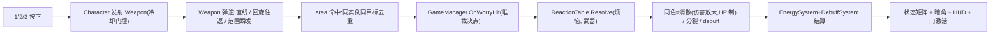

## 产品概述
在 Godot 项目「溢界」中实装「相消相克」战斗框架并全面换用**几何色块视觉**(零 png / 零贴图 / 零 tileset)。游戏讲述一个人从学校、工作到老年的成长过程,路上遇到三种「烦恼」,玩家用三种「应对武器」处理;用对方法烦恼消散,用错方法烦恼分裂或给玩家上 debuff。

## 视觉规范(本次新增,必须落实)
- 所有对象一律是「**外亮内暗**」的双层色块:亮色粗边框 + 同色相暗色填充,由代码 `_Draw()` 绘制,不再引用任何图片资源。
- 身份色映射(用户指定,照此实现):
  - 玩家 = 黄;疑(Doubt)= 绿;压(Pressure)= 红;孤(Loneliness)= 蓝
  - 背景与地面 = 紫;笔(Act)= 绿、橡皮(Accept)= 红、纸(Express)= 蓝
  - 武器色恰好等于其可「消散」的烦恼色,**同色即克制**,成为一眼可读的玩法语言。
- 应用范围:玩家、烦恼、武器、传送门、精力/成就条、朝向指示、地面全部改为代码色块;彻底移除 player 角色帧动画、worry 三张 png、heart 精灵表、book 贴图与 tileset 引用。

## 核心玩法与裁决(沿用已确认决策)
- 三烦恼:疑(原地打转不追人)、压(拖箱缓慢移动)、孤(半透明、远离玩家会贴到身后)。
- 三武器:笔=直线单体远快;纸=回旋镖往返群体;橡皮=以自身为圆心的范围群体瞬发。均按下即发、受冷却限制。
- **相克 + 保留血条**:烦恼保留 HP 并随时间成长体型(时间压力);正确武器伤害放大(约 2 发快速解决);错误武器不扣血,只施惩罚;血量成长是时间压力而非可磨掉的盾。
- 相克矩阵(无变异):笔×疑=消散、笔×压=分裂、笔×孤=疏离;纸×疑=分裂、纸×压=怨气、纸×孤=消散;橡皮×疑=认命、橡皮×压=消散、橡皮×孤=分裂。
- 消散:精力+12、成就+15、解 1 层 debuff;分裂:同类 +1(上限 8)、成就-8;debuff 上 1 层(上限 2,重复刷新时长):疏离=视距-40%(暗角遮罩)/20s、怨气=额外流失+0.2/s/15s、认命=移速-30%/20s。
- **惩罚节奏(用户已定)**:同一武器实例对同一烦恼只触发一次后果,持续接触不每帧结算。
- 操作:WASD 8 向移动与朝向,数字 1/2/3 释放对应武器;发射时软锁定(±30° 锥内、强度 0.85,仅修正方向)。
- 双条:精力每秒流失 0.5+场上烦恼数×1.0,越低视线越暗,归零「崩溃」=失控 3 秒后回 35%、成就-20(不死亡);成就消散+15、分裂-8(下限 0),满 100 开启传送门进下一关。
- 精力×成就 2×2 状态矩阵(带滞后):日常/顺境(移速+20%、冷却-30%)/倦怠(视距-60%、移速-40%、每 5s 僵直 2s)/透支(移速+20%、判定+50%、流失×1.5、视距-30%)。
- 三关结构同构,差异仅烦恼生成比例与初始精力:学校(疑多,100)→ 工作(压多,85)→ 老年(孤多,70),烦恼由不可摧毁生成器产出,玩家跑赢生成速度。


## 技术栈
沿用 Godot 4.7 + C#/.NET(Forward Plus,d3d12,canvas_items + aspect=expand),不引入第三方依赖。视觉层全部用 CanvasItem `_Draw()` 自绘,禁止引用任何 png/tileset。

## 现状核对(已读代码确认)
- `Character.cs`:已有 8 向 `GetVector`、`Facing`、按 delta 精力结算、三槽冷却与武器发射管线,但绑定 `AnimatedSprite2D`(10 张角色帧)与 `Heart` 节点,纸/橡皮还是「按住续力-松开回收」旧模型,精力数值写在 Character 内。
- `GameManager.cs`:已是唯一裁决点雏形(`AttachWeapon` 订阅三武器的 `WorryHit` 事件 → `OnWorryHit` 扣血制),但仍是「任意武器扣血、清零即消散」,并用定时补怪 + 单关 `ReloadCurrentScene` 循环;HUD 引用 `../Hud/Bars/{EnergyBar,AchieveBar}` 与 `../Hud/Message`(用 `GetNodeOrNull`,安全)。
- `Worry` 及子类:根节点为 Area2D(带 `worry` 组、`Radius`、`TakeDamage(damage)->bool dissolved`);武器也是 Area2D,命中走面积相交检测。
- `Heart.cs`:五档帧动画精灵,改造后不再被引用。
- 输入映射 `action 1/2/3` 绑定 J/K/L,方向 deadzone 0.2;`project.godot` 的 `run/main_scene` 是 uid 引用,未解析到具体文件。
- `scenes/theme/{prime,youth,old}.tscn` 三关结构差异大(仅 youth 实例化了 `game_manager.tscn`),prime 是当前完整玩法关卡。

## 总体策略
在现有「Area2D 事件裁决 + Character 发射管线」骨架上做三件事:裁决语义升级为「相克+保留血条」、武器模型简化为「按下即发+冷却」、全视觉替换为自绘色块。旧 `prime/youth/old` 三关文件保留作备份不删除,新建三关同构场景,`main_scene` 改指向新「学校」关。



## 关键技术决策
1. **裁决接入最小化**:保留现有 `AttachWeapon` 事件管线与 `Worry.TakeDamage`,把 `OnWorryHit` 的规则从「扣血即消散」换成「查表三选一」——正确武器伤害取 `ReactionTable.CorrectDamage`(≈两发清,数值可调),错误武器伤害置 0 只执行分裂/上 debuff;分裂体继承母体当前 HP 与体型。
2. **惩罚节奏天然成立**:武器重构成一次性命中事件(实例销毁/单次结算)+ 每飞行实例 `HashSet` 命中去重,纸往返不重复触发,持续接触不再按帧扣,对应已确认的「只罚一次」。
3. **烦恼保持 Area2D 基类不动**:现状烦恼为 Area2D、武器为 Area2D,命中走 `area_entered` 最顺;移动 AI 用手动位移,不引入 CharacterBody2D 重构。碰撞层:1=玩家、2=烦恼、3=武器、4=门;武器 Area2D `layer=3/mask=2`、烦恼 `layer=2`(monitoring 检测玩家层 1,孤贴背用 `body_entered`)、门 `layer=4` 检测玩家。
4. **HUD 沿用现有 ProgressBar + 运行时 StyleBoxFlat**:GameManager 已有的 `ApplyBarStyle` 代码上色模式就是为此设计的(编辑器会清场景内手工 StyleBoxFlat);精力条=黄亮框暗芯、成就条=紫亮框暗芯,另加状态名 Label 与 1/2/3 冷却小色块(三武器色),不新建复杂 UI 框架。
5. **崩溃替换判负**:删除「精力耗尽→失败重开」分支;归零改由 Character 进入 3 秒失控(锁输入),随后精力回 35% 且成就-20。胜利也删——改由成就满激活 Portal,玩家触门 `ChangeSceneToFile` 切下一关。
6. **刷怪移交生成器**:移除 GameManager 定时补怪,新增 `WorrySpawner`(三种烦恼 PackedScene+权重、激活距离、定时、Alive 上限),三关差异 = 场景内 spawner 权重组合 + 初始精力;GameManager 只维护场上烦恼列表(精力流失热路径数据源,不每帧遍历场景树)。
7. **玩家自绘方案**:删除 `AnimatedSprite2D`/`Heart` 引用;`Character._Draw` 直接画黄色方形 + 随 `Facing` 旋转的亮黄小三角(8 向方形无朝向信息,三角即计划中的朝向指示器,不再单列节点);其余实体(烦恼/武器/门/生成器/地板/边界墙)用共享 `ColorBlock` 自绘组件子节点。

## 性能与可靠性要点
- 烦恼列表由 GameManager 维护增删,`EnergySystem.Tick` 只读计数;实体总量 <40,每帧 `_Draw` 数个矩形无压力。
- `QueueRedraw()` 仅在尺寸/颜色/形态变化时调用;烦恼体型随 HP 增长时按事件/低频率(0.2s 节流)刷新,避免每帧重绘。
- 色值集中 `Palette`(每身份色一档亮框一档暗芯),裁决数值集中 `ReactionTable`,均纯 C# 静态,不依赖场景。
- 日志仅打印生成/消散/分裂/debuff/状态切换/崩溃等关键节点,严禁每帧输出。
- 手写 `.tscn` 前必须先通读 `prime.tscn`,提取 Player/HUD/GameManager 的节点路径与脚本引用,防止重建关卡时漏接线;新增 `.cs` 需在 Godot 编辑器导入一次生成 `.cs.uid`,否则场景脚本引用失效。

## 目录结构
```
script/
├── Types.cs             [NEW] 纯 C# 枚举与结构:WorryType/WeaponType/Reaction/DebuffType/PlayerState/ReactionResult
├── ReactionTable.cs     [NEW] 静态 3×3 相克表 + 全部数值常量(消散/分裂/debuff 增减、CorrectDamage、成长速率、冷却/射程/滞后阈值)
├── Palette.cs           [NEW] 身份色表:每身份(玩家/疑/压/孤/武器×3/紫系)提供 Frame(亮)与 Core(暗)双色;含背景/地面/文本色
├── ColorBlock.cs        [NEW] Node2D 自绘组件:ShapeMode(方形/长条/菱形/圆环/三角)、Frame/Core、尺寸、边框厚;父脚本改属性后 QueueRedraw
├── Worry.cs             [MODIFY] 保留 Area2D 基类、组与移动 AI;新增 HP 随时间成长 + 体型=边长 + WorryType 暴露;移除对贴图/外观的依赖(外观交给子 ColorBlock)
├── worries/Doubt.cs     [MODIFY] 疑:AI 原地打转;外观取 Palette 绿
├── worries/Pressure.cs  [MODIFY] 压:拖任务箱缓移(小色块子节点示意箱);外观红
├── worries/Loneliness.cs[MODIFY] 孤:远离+贴背;Modulate 半透明;外观蓝
├── IWeapon.cs           [MODIFY] 接口简化:Launch(Vector2 dir)/Cooldown/命中事件一次上报,去掉 held/续力语义
├── weapons/Act.cs       [MODIFY] 笔:直线单体、命中即毁、短冷却;绿色长条色块
├── weapons/Express.cs   [MODIFY] 纸:去程+折返弧线、HashSet 命中去重、群体、往返中不可再发;蓝色菱形色块
├── weapons/Accept.cs    [MODIFY] 橡皮:以玩家为圆心范围判定、群体、瞬发+冷却、单次结算;红色圆环色块
├── EnergySystem.cs      [NEW] 纯 C# 规则类(非 Godot 节点):精力/成就双条、流失速率、崩溃、带滞后 2×2 状态矩阵
├── DebuffSystem.cs      [NEW] 纯 C#:三层 debuff 的层数/时长/刷新与聚合系数查询(视距/移速/额外流失)
├── VisionOverlay.cs     [NEW] CanvasLayer(100)+TextureRect 径向渐变暗角:按精力与疏离层数写透明度;同时是「疏离」debuff 的形态
├── WorrySpawner.cs      [NEW] Node2D 生成器:激活距离、定时、Alive 上限、三烦恼 PackedScene+权重
├── Portal.cs            [NEW] Area2D 门:成就未满禁用隐藏;满 100 激活呼吸闪烁,玩家触碰 ChangeSceneToFile(NextScenePath)
├── Heart.cs             [DEPRECATE] 不再被任何活动场景引用,保留文件避免破坏旧备份场景
├── Character.cs         [MODIFY] 删除 AnimatedSprite2D/Heart 引用与按住武器逻辑;自绘黄块+朝向三角;接入三武器按下即发与崩溃锁输入
└── GameManager.cs       [MODIFY] 唯一裁决点改查表;移除定时补怪;持有 EnergySystem/DebuffSystem 并驱动 HUD/暗角/门;崩溃与切关接入

scenes/object/
├── doubt.tscn           [MODIFY] 移除 png,换 ColorBlock(绿),挂 Doubt.cs
├── pressure.tscn        [MODIFY] 移除 png,换 ColorBlock(红)+任务箱小色块,挂 Pressure.cs
├── loneliness.tscn      [MODIFY] 移除 png,换 ColorBlock(蓝,半透明),挂 Loneliness.cs
├── act_weapon.tscn      [MODIFY] 绿色长条色块 + CollisionShape2D,挂 Act.cs
├── express_weapon.tscn  [MODIFY] 蓝色菱形色块 + CollisionShape2D,挂 Express.cs
├── accept_weapon.tscn   [MODIFY] 红色圆环特效 + 范围 CollisionShape2D,挂 Accept.cs
├── player.tscn          [MODIFY] 移除全部角色帧 png 与 Heart 子节点;collision layer=1;自绘节点
├── spawner.tscn         [NEW] Node2D + 紫色亮框色块 + 警告纹理由代码画,挂 WorrySpawner.cs
├── portal.tscn          [NEW] Area2D + 紫色大色块(关/开两态),挂 Portal.cs
└── vision_overlay.tscn  [NEW] 暗角遮罩,挂 VisionOverlay.cs

scenes/theme/
├── school.tscn          [NEW] 完整可玩「学校」关:紫地面色块 + 玩家 + 生成器(疑权重高)+ Portal(→work)+ GameManager + HUD + 暗角,初始精力 100
├── work.tscn            [NEW] 同构,压权重高,初始精力 85,Portal 指向 family
├── family.tscn          [NEW] 同构,孤权重高,初始精力 70
├── prime.tscn / youth.tscn / old.tscn  [DEPRECATE] 保留作备份,不再被 main_scene 或新关卡引用
└── game_manager.tscn    [DEPRECATE] 旧独立 GM 场景不再被实例化(新关卡直接挂 GameManager.cs)

project.godot            [MODIFY] action 1/2/3 物理键改为数字 1/2/3;方向 deadzone 0.2→0.15;main_scene 指向 res://scenes/theme/school.tscn
```

## 关键代码结构
裁决核心(唯一裁决点):

```csharp
// ReactionTable.Resolve:静态 3×3 拉丁方,错误武器返回 Split/Debuff,正确武器 Dissolve
public static ReactionResult Resolve(WorryType worry, WeaponType weapon);

// GameManager.OnWorryHit 改造(原扣血制升级为相克+保留血条):
//   命中 → Resolve → 正确:TakeDamage(CorrectDamage) 与成长 HP 对抗,HP 归零才消散结算
//                      错误:伤害 0,只执行 Split(新个体继承母体 HP)或 DebuffSystem.Apply
//   惩罚已由「同实例同目标单次事件 + 飞行去重」天然限频,不再有接触帧结算
```

外观核心(零贴图):

```csharp
// Palette:每身份一个双色对(亮框 Frame / 暗芯 Core),取色即克制反馈
public static class Palette
{
    public static (Color Frame, Color Core) Player  => (黄亮, 黄暗);
    public static (Color Frame, Color Core) Doubt   => (绿亮, 绿暗); // 与 Act 同色
    public static (Color Frame, Color Core) Act     => (绿亮, 绿暗);
    // Pressure=Accept 红、Loneliness=Express 蓝、Portal/地面=紫系,同结构
}

// ColorBlock._Draw:先铺暗芯矩形,再描亮框,天然满足「外亮内暗」
public override void _Draw()
{
    var r = new Rect2(-W / 2, -H / 2, W, H);
    DrawRect(r, Core);
    DrawRect(r, Frame, false, FrameThickness);
}
```

能量与 debuff 对外接口(纯 C#,由 GameManager 持有并驱动):

```csharp
public sealed class EnergySystem {
    public float Energy, Achieve; public PlayerState State;
    public void Tick(float delta, int worryCount, DebuffSystem d); // 流失+debuff+状态滞后判定
    public void ApplyDissolve(); public void ApplySplit(); public void ApplyBreakdown();
}
public sealed class DebuffSystem {
    public void Apply(DebuffType t);              // 上限2层,第2层翻倍,重复刷新时长
    public float SightScale, MoveScale, ExtraDrain; // 聚合系数,供遮罩/移速/流失读取
}
```


## 设计语言
纯几何抽象风:全部实体为「外亮内暗」双层色块,粗亮边框 + 同色相暗芯,无任何贴图/描线素材。身份色即玩法语言——**武器色与其能消散的烦恼同色**,玩家天然学会「打同色、躲异色」。
- 玩家:亮黄边框暗黄芯方形,内部一枚随 8 向 Facing 旋转的亮黄小三角指向瞄准方向;静止时三角保持最后朝向。
- 烦恼:方形色块。疑=绿(自转 wobble 表达原地打转)、压=红(身侧拖一只暗红小箱块)、孤=蓝(整体半透明,似游离)。体型随 HP 增大,是唯一随时间膨胀的对象。
- 武器:笔=绿色细长条(直线弹道);纸=蓝色小菱形(往返弧线);橡皮=以玩家为圆心的红色圆环瞬间扩张又收敛(范围提示)。发射时同色命中=亮闪缩小消失;错色命中烦恼不扣血,分裂出新生烦恼或给玩家上 debuff。
- 传送门:暗紫芯 + 亮紫粗框大方形;成就未满时暗芯无光,满 100 后亮框呼吸脉动(明暗渐变动画提示可进)。
- 地面与背景:画布清屏为深紫近黑;可活动地面为大块中紫色矩形,四周边界是亮紫细框 StaticBody,视觉上「世界是一张暗紫纸,角色是纸上发光的方块」。
- HUD:左上双条——精力条(黄系亮框暗芯)与成就条(紫系亮框暗芯,与门同色暗示「满了就开门」);其下状态名与 debuff 标签用对应身份色文字;右下 1/2/3 三枚小色块(绿/蓝/红)显示武器冷却,冷却中暗芯熄灭。
- 低精力反馈:全屏四角径向暗角随精力下降压暗、随「疏离」层数额外收缩,与紫背景融为一体,不打断色块可读性。
- 视觉动效仅三类:命中闪白收缩、门呼吸、橡皮圆环扩张,克制且统一;所有颜色改动只改 Palette 一处。
